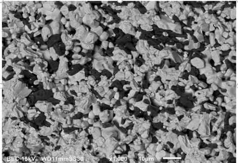
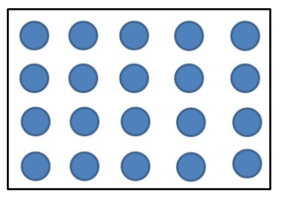
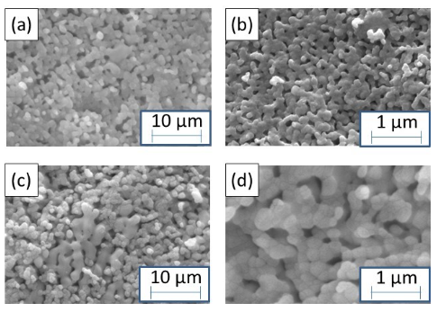
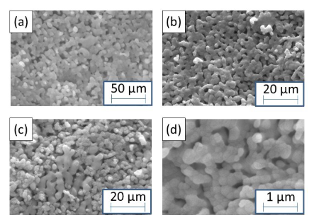

### Post Test
1.Which of following can NOT increase resolution (tick all which applies): 
a) increasing incident voltage     b) increased vacuum    <b> c)increasing beam spot size</b>  d) decreasing working distance  

2.What is the dark region in this image?  
 
a) Matrixb) Reinforcement   c) Graind) <b>d)Porosity</b> 
3.What is the dark region in this image? 
 
a) Matrix<b>b) Reinforcement</b>   c) Graind) Porosity   
4.What is the estimated matrix phase content in the following image? 
 
a) 30 %b) 45 %c) 60% <b>d) 75 %</b> 
5.In which case the porosity is of biggest size 
 
 a) A b) B <b>c) C</b> d) D 
6.In which case the porosity content is highest? 
 
a)A  b)B c)C <b>d)D</b> 
7.In which of the following, the grain size is biggest: 
 
<b>a) A</b>b) B c) C d) D  
8.In which of the following, the grain size is smallest:  
 
a) A <b>b) B</b> c) Cd) D 