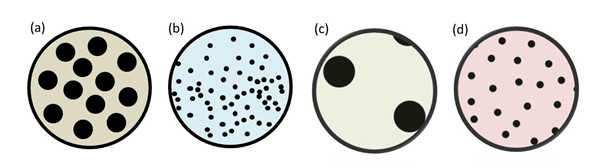
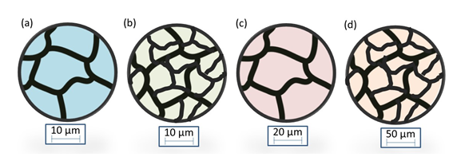

## <b> Pre-test
#### Please attempt the following questions
1.The void portion, or empty spaces, in the material is called:  

Matrixb) Reinforcementc) Impurity<b>d) Porosity </b> 

2.The homogeneous material, which acts as a medium to hold the reinforcement is called:  

<b>a) Matrix</b>b) Reinforcementc) Impurityd) Porosity  

3.The definite amount of additive used in the bulk material to provide or encourage a response (positive or negative) against a stimulus in a material is called.  

a) Matrix<b>b) Reinforcement</b>c) Impurityd) Porosity  

4.The presence of un-intended particle or reaction product in the material that alters the predicted behaviour of material is called.  

a) Matrixb) Reinforcement<b>c) Impurity</b>d) Porosity  

5.Which of the following has the most superior dispersion of particles?  
 

a) Configuration (a)b) Configuration (b)c) Configuration (c)<b>d) Configuration (d)</b>  

6.Which one has the biggest grain size among following?  
 
a) Configuration (a)b) Configuration (b)c) Configuration (c)<b>d) Configuration (d)</b>  

7.Magnification of the SE image depends on:  

a) incident voltage    b) Vacuum level   <b>c) scan area of sample</b>    d) working distance  

8.The SE imaging provides sharper images because of its high   

vacuum    b) voltage   c) working distance    <b> d) depth-of-field</b> 
